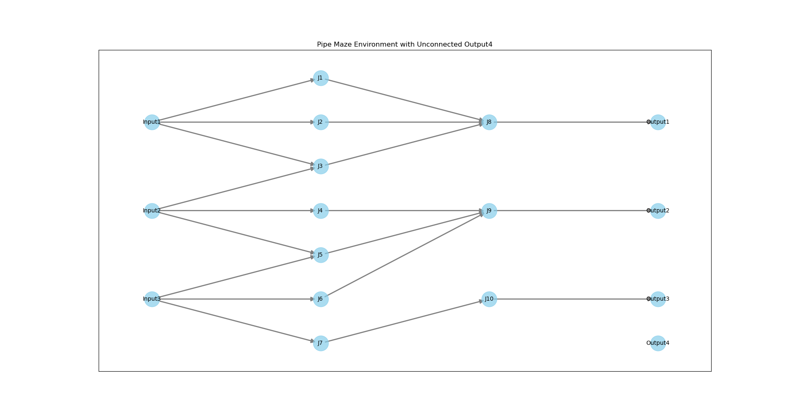

# susskind-pipe-theory

Leveraging graph theory and reinforcement learning to find the input for a
desired output in a pipe maze.

## How to run

### create a virtual environment

```bash
python -m venv venv
```

### activate the virtual environment

```bash
source venv/bin/activate
```

### install the dependencies

```bash
pip install -r requirements.txt
```

### run the project

```bash
python src/core.py
```

## Problem Statement

<!-- TODO: original statement -->

<!-- A maze of water pipes with multiple input and output. The goal is to connect -->
<!-- the input to the output. The maze is a grid of pipes. Each pipe has a direction -->
<!-- and a connector. The connector can be connected to another connector of another -->
<!-- pipe. The maze is randomly generated. The input and output are randomly placed -->
<!-- on the border of the maze. The goal is to release the water only from the -->
<!-- specified outputs. The question is opening which input will lead to the desired -->
<!-- output. The project can be further extended by considering the flow of water -->
<!-- in the maze. How the water will react to the gravity and the pressure and what -->
<!-- happens when water faces a multi-way junction. -->
<!---->
<!---->
<!-- The question is a demonstration of the power of the graph theory in solving -->
<!-- practical problems. -->
<!---->
<!-- Another practical application of the question is in the design of computer -->
<!-- networks. It's also can be used to find out the internal structure of a circuit -->
<!-- or a chip. -->

### Problem Description

There are multiple input water sources and multiple output water sinks. There
is a set of hidden layers of junction nodes between the input and output. The
input, hidden layers and the output layers are connected by a set of pipes. The
sinks have a max capacity of water they can take. If the water flow is more
than the capacity of the sink, the water will be overflowed to the next
(downstream) sink. No water should be overflowed from the last sink. When the
water reaches a junction node, it will be divided into multiple paths. The
division of the water is based on the capacity of the downstream pipes.
Connection pipes are built differently. Some pipes have a fixed capacity, some
can increase the capacity based on the water pressure, and some have a chance
of breaking or getting blocked; If a pipe has gotten blocked the water can't
flow through connections therefor the input node of pipe will have more water
to distribute to the other pipes, and if a pipe has broken and leaking, the
water will continue to flow to pipe but with an increased flow rate therefor
the input node of pipe will have less water to distribute to the other pipes.
The goal is to find the input sources that will lead to the desired water
amount in the output sinks. The algorithm should find the input sources that
will lead to closest possible water amount in the output sinks (It's possible
that the exact amount of water can't be reached).

It's preferred that the water flow is simulated and plotted in the maze. The
simulation should consider the pressure, gravity, and the flow rate of the
water. The simulation should be able to show the water flow in real-time.

The original problem is defined in a grid of pipes that have different pipe
connections in each index of the grid. But using such model will make the
problem needlessly more complex and harder to solve. Even generating random
valid mazes is harder. Instead, the problem can be simplified by using a graph
representation of the maze. The graph representation will have nodes that
represent the junctions and the sinks. The edges will represent the pipes. The
edges will have a weight that represents the capacity of the pipe. The graph
representation will make it easier to generate random mazes and to solve the
problem. Even if the input is given as a grid of pipes, it can be easily
converted to a graph representation, but for the sake of simplicity, I will
assume that the input is given as a graph representation.



### Approach

The problem can be solved using reinforcement learning. The input sources can
be considered as the actions and the water amount in the output sinks can be
considered as the rewards. The goal is to find the input sources that will lead
to the desired water amount in the output sinks. The problem can be solved using
Q-learning. The Q-learning algorithm can be used to find the optimal policy
that will lead to the desired water amount in the output sinks. Another approach
is to use the Monte Carlo method to find the optimal policy.

The challenge to solve the problem is that the depth of the maze is unknown,
and a bad algorithm can take a long time to find the optimal policy.

Another challenge is the fact that there might not be a solution to the problem
given a certain maze. Finding an optimal policy in a maze that leads to the
closest possible water amount in the output sinks is a NP-hard problem.

### Input and Output

Currently, the input is considered as a list of node IDs, relation to other
nodes, and other necessary information pipes. The input is almost the same as
as the input of TSP problem that is a list of nodes and the distance to other
nodes that are connected to it. This data is randomly generated or can be read
from a file. The model is trained based on this data.

The second input is the desired water amount in the output sinks. This data can
be randomly generated, can be read from a file, or can be given as an input in
the command line.

The output is the input sources and the corresponding water pressure or time
that will lead to the desired water amount in the output sinks. The output can
be printed in the console or can be saved in a file.

### Evaluation

The model can be evaluated based on the time it takes to find the optimal policy
and the accuracy of the policy.

### Extensions

The problem can be extended by considering that there are customizable nodes
in the hidden layers that can increase or decrease the water pressure.

Another extension is to consider that the output sinks have a time limit or and
a priority.

Another extension is to consider that the output sinks consume the water in
it's reservoir based on a rate in time.

### Relatable Problems

The design of computer networks and the web of the connections is a similar
problem.

The connections in a circuit or a chip, the input and output of the circuit
is a similar problem.

A hypothetical problem is the web of the connections in the brain. We can
easily control and measure the input and output of the brain, but the
connections in the brain is a mystery. With a model that can guess the
connections can be used to help with design of a computer that can mimic the
brain. Giving the chance to people to understand the brain better. It might
even be possible to create computer that replaces the parts of the brain that
are damaged; Similar to the technology that lets blind people see basic colors
and shapes with an interface placed in the brain, a camera, and a computer.

## Other Notes

### Project name

The project is named after Leonard Susskind, a theoretical physicist who
developed the holographic principle. The holographic principle is a principle
of string theory and a supposed property of quantum gravity that states that
the description of a volume of space can be thought of as encoded on a lower
dimensional boundary to the region—preferably a light-like boundary like a
gravitational horizon. Why I chose this will be a mystery that will never be
known to humankind.
